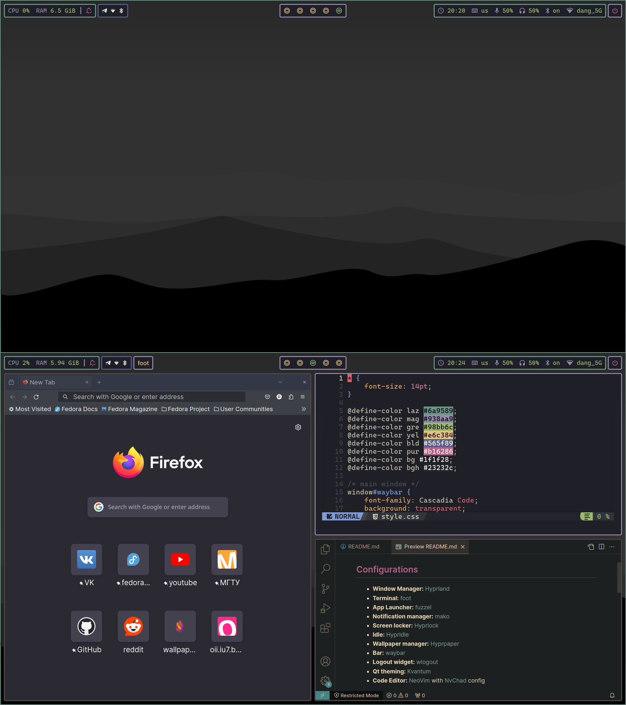

# dangooddd linux dotfiles
Minimal setup for work by dangooddd



## Configurations 
* **Window Manager:** [Hyprland](https://github.com/hyprwm/Hyprland)
* **Terminal:** [foot](https://codeberg.org/dnkl/foot)
* **App Launcher:** [fuzzel](https://codeberg.org/dnkl/fuzzel)
* **Notification manager:** [mako](https://github.com/emersion/mako)
* **Screen locker:** [Hyprlock](https://github.com/hyprwm/hyprlock)
* **Idle:** [Hypridle](https://github.com/hyprwm/hypridle)
* **Wallpaper manager:** [Hyprpaper](https://github.com/hyprwm/hyprpaper)
* **Bar:** [waybar](https://github.com/Alexays/Waybar)
* **Logout widget:** [wlogout](https://github.com/ArtsyMacaw/wlogout)
* **Qt theming:** [Kvantum](https://github.com/tsujan/Kvantum/tree/master/Kvantum)
* **Code Editor:** [NeoVim](https://github.com/neovim/neovim) with [NvChad](https://github.com/NvChad/NvChad) config
* **Font:** [Inter](https://github.com/rsms/inter) as UI font and [Cascadia Code Nerd](https://github.com/microsoft/cascadia-code) as monospace font

## <span style="color:#b16286">Packages</span>
### <span style="color:#e6c384">Fedora</span>
Enable some copr repos:
```bash 
sudo dnf copr enable atim/starship
sudo dnf copr enable che/nerd-fonts
sudo dnf copr enable tofik/nwg-shell
sudo dnf copr enable solopasha/hyprland
```
Then install packages (including some quality of life packages):
```bash
sudo dnf install cascadia-code-fonts cascadia-code-pl-fonts rsms-inter-fonts nerd-fonts starship nwg-look kvantum qt6ct zoxide foot fuzzel mako waybar wlogout neovim hyprpaper hyprlock hypridle
```
And finally install hyprland:
```bash 
sudo dnf install hyprland-git --exclude kitty
```

## Installation

### Download
```bash
git clone https://github.com/dangooddd/.dotfiles.git
```

### Manual
Copy or symlink all config directories you want to install:
```bash
ln -s /path/to/.dotfiles/.config/config_dir $HOME/.config/ 
```
If you want to use gtk theme of my choice:
```bash
ln -s /path/to/.dotfiles/.themes $HOME/
```

### Via script
> [!Warning]
> Method below may be dangerous! Some files from your .config and .themes directories can be deleted, so read code and make your decision!
```bash
cd .dotfiles
./install.sh
```

If you want to delete your old configs that was moved to .bak directories:
```bash
./clean.sh
```
