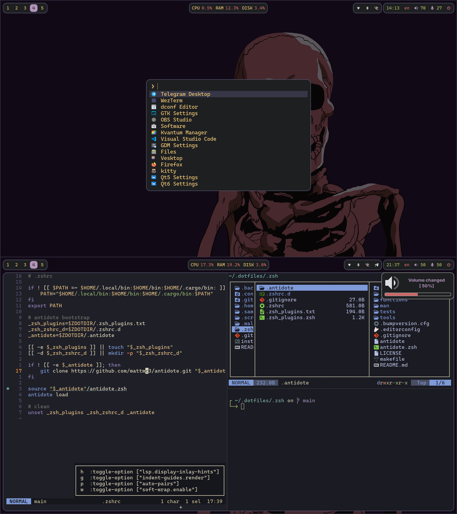

# dangooddd linux dotfiles
Minimal setup for work by dangooddd



## Configurations 
* **Window Manager:** [Hyprland](https://github.com/hyprwm/Hyprland)
* **Terminal:** [WezTerm](https://github.com/wez/wezterm)
* **Prompt:** [Starship](https://github.com/starship/starship)
* **App Launcher:** [fuzzel](https://codeberg.org/dnkl/fuzzel)
* **Notification manager:** [dunst](https://github.com/dunst-project/dunst)
* **Screen locker:** [hyprlock](https://github.com/hyprwm/hyprlock)
* **Idle:** [hypridle](https://github.com/hyprwm/hypridle)
* **Wallpaper manager:** [hyprpaper](https://github.com/hyprwm/hyprpaper)
* **TUI file manager:** [Yazi](https://github.com/sxyazi/yazi)
* **Bar:** [ags](https://github.com/Aylur/ags)
* **Code Editor:** [Helix](https://github.com/helix-editor/helix)
* **Font:** [Inter](https://github.com/rsms/inter) as UI font and [Cascadia Code](https://github.com/microsoft/cascadia-code) as monospace font

## Packages
### Fedora
Enable some copr repos:
```bash 
sudo dnf copr enable che/nerd-fonts
sudo dnf copr enable solopasha/hyprland
sudo dnf copr enable tofik/nwg-shell
sudo dnf copr enable peterwu/rendezvous 
sudo dnf copr enable wezfurlong/wezterm-nightly
```
Then install packages:
```bash
sudo dnf install zsh python python-pip python3-psutil cascadia-code-fonts cascadia-code-pl-fonts rsms-inter-fonts nerd-fonts bibata-cursor-themes grim slurp wl-clipboard papirus-icon-theme unar jq fd-find ripgrep fzf poppler network-manager-applet blueman pamixer brightnessctl wezterm fuzzel nwg-look kvantum qt6ct zoxide cargo dunst aylurs-gtk-shell-git helix just hyprpaper hyprlock hypridle
```
Then install language-dependent packages:
```bash
pip install pywal
cargo install --locked starship
cargo install --locked --git https://github.com/sxyazi/yazi.git yazi-fm yazi-cli
```
Then install yazi plugins:
```bash
ya pack -a yazi-rs/plugins#full-border
```
End of installing dependencies:
```bash
sudo dnf install hyprland-git --exclude kitty
```
Change shell to zsh:
```bash
chsh -s $(which zsh)
```

## Installation

### Download
```bash
git clone https://github.com/dangooddd/.dotfiles.git
```

### Manual
Copy or symlink all directories you want

For hyprland it is necessary to copy .samples/user-config.conf and .samples/user-variables.conf into .config/hypr/user

For ags it is necessary to copy .samples/user-options.js into .config/ags/

### Via script
> [!Warning]
> Method below may be dangerous! Some files from your filesystem can be deleted, so read code and make your decision!

Script will symlink dotfiles to your filesystem (existing directories will be moved in /path/to/dotfiles/.backup)
```bash
cd .dotfiles
./install.sh
```

### After installation
If you have problems with something (you definitely would)
check my [setup guide](SETUP.md)
